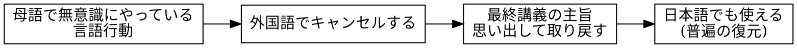
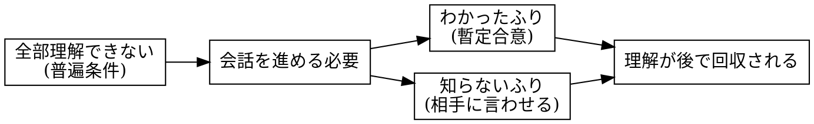

もちろんです。ここまでの議論を踏まえて、**留学生向け最終講義**の「まとめ」と「目次（構成案）」を作ります。
タイトルは先生が選んだこれで行きます。

**The Part You Already Have, and the Part You Have to Train**

---

# まとめ（この講義で伝えること）

この最終講義の目的は、日本語を「新しい能力」としてゼロから積み上げるのではなく、学習者が母語ですでに持っている言語行動を思い出し、それを日本語でも再び使えるようにすることである。
外国語学習では、母語で自然に行っている推測・補完・調整・合意形成の技能が、なぜか封印され、「正確な文を作ること」に意識が集中してしまう。その結果、会話が止まり、理解も止まる。
しかし実際の言語使用では、送り手と受け手の間で完全理解が常に成立しているわけではなく、暫定合意や未回収を抱えながら進むことが、普遍的な人間の言語運用である。
「わかったふり」や「知らないふり」は、ごまかしではなく、時間が止まらないインタラクションを成立させる正規のストラテジであり、日本語でも同じように使える。
母語でも分からない内容を日本語だけで理解しようとしてしまうと、理解の土台がないまま言語だけで押し切ろうとするため破綻する。したがって、学習とは「普遍（すでに持っているもの）」と「実装（訓練が必要なもの）」を切り分け、普遍をキャンセルせずに日本語の実装を積み上げることだと位置づけられる。

---

# 目次（留学生向け最終講義の構成案）

## 0. Title

**The Part You Already Have, and the Part You Have to Train**

## 1. 導入: 日本語を学ぶ前に、あなたはもう言語を持っている

- 「日本語はゼロからではない」という見取り図
- 今日の結論（先に提示して安心させる）

## 2. 言語は何か: 送り手と受け手のあいだの合意形成

- 言語は「意味を運ぶ」だけではない
- 会話はコンセンサスで進む

## 3. 即時文法と調整文法: 話すときと書くときで、成立条件が違う

- 即時: 時間が止まらない
- 調整: 読者の知識を見積もって整える
- どちらも「書きすぎ/書き不足」は失敗になる

## 4. なぜ留学生は普遍をキャンセルしてしまうのか

- 「正確さ」への過集中
- 母語でやっている技が止まる
- 結果として硬くなる/黙る

## 5. 母語でも分からないものを、日本語だけで分かろうとしない

- 「日本語の問題」と「内容の問題」の切り分け
- 内容理解の土台がないときに起きる二重停止

## 6. 時間が止まらない世界で必要な技: “わかったふり”と“知らないふり”

- わかったふり = 暫定合意で進める
- 知らないふり = 相手に言わせて回収する
- 理解は後で回収される（未回収→回収）

## 7. 実装としての日本語: 訓練が必要な部分

- 語彙と定着ユニットの増強
- 句の組み立てと運用
- 調整文法（書く・説明する）の訓練

## 8. まとめ: 日本語を増やすのではなく、あなたの言語行動を戻す

- 最終メッセージ（先生の核）
- 「できる」は増える
- 日本語でも普遍を使ってよい

## 9. Closing (one line)

**Use the part you already have. Train the part you need.**

---

必要なら、この目次をそのまま **スライド10枚版**（各スライドの見出し + 1行メッセージ）にもできます。

承知しました。では、先ほどの目次を **スライド10枚版**に落とします。
留学生向けなので、1枚ごとの情報量は少なめにして、流れで分かる形にします。

---

# 最終講義（留学生向け）スライド10枚構成

**The Part You Already Have, and the Part You Have to Train**

---

## Slide 1. Title

**The Part You Already Have, and the Part You Have to Train**

- 日本語はゼロからではない
- 今日は「学び方」を話します

---

## Slide 2. You already have something

**You are not starting from zero.**

- 母語で毎日やっていることがある
- それは日本語でも使える

---

## Slide 3. What is language?

**Language is interaction.**

- 言語は送り手と受け手の間で成立する
- いつも「合意」を作りながら進む

---

## Slide 4. Two layers

**Two layers: Immediate and Adjustive.**

- 即時文法: 時間が止まらない中で話す
- 調整文法: 整えて書く・説明する

---

## Slide 5. Why you get stuck

**You cancel your universal skills.**

- 日本語になると急に「正確さ」だけに集中する
- その結果、話せない・止まる

---

## Slide 6. The big warning

**Don't try to understand in Japanese what you don't understand even in your native language.**

- それは日本語の問題ではなく「理解の問題」
- 二重に止まる原因になる

---

## Slide 7. Time does not stop

**Conversation never waits.**

- 分からなくても会話は進む
- 完璧な理解は前提ではない

---

## Slide 8. The real technique

**Let's "pretend to understand."**

- 「わかったふり」はズルではない
- 暫定合意で前に進む技術

---

## Slide 9. Another technique

**Let's "pretend not to know."**

- 「知らないふり」で相手に言わせる
- 理解はあとで回収できる

---

## Slide 10. Closing

**Use the part you already have. Train the part you need.**

- 日本語を増やすだけではない
- 自分の言語行動を思い出して、日本語で使う

---

必要なら、この10枚にそれぞれ **先生の語り（30秒ずつ）**を付けて、完全な講義原稿（10分版/20分版/45分版）にもできます。

英語（スライド1行で強い）

    You already know how to use language. Use it in Japanese too.

    You are not starting from zero. You are transferring skills.

    Don't aim for perfect understanding. Aim for staying in the conversation.

    In Japanese, do what you already do in your first language.

    Your native language is not the enemy. It's your strongest tool.

    Keep going. Understanding comes later.

Remember what you already do in your own language.
You are not starting from zero.
You are rebuilding your skills in Japanese.

もう少し先生の語感に寄せるなら、

You already know how to use language.
Now, use the same human skills in Japanese.
